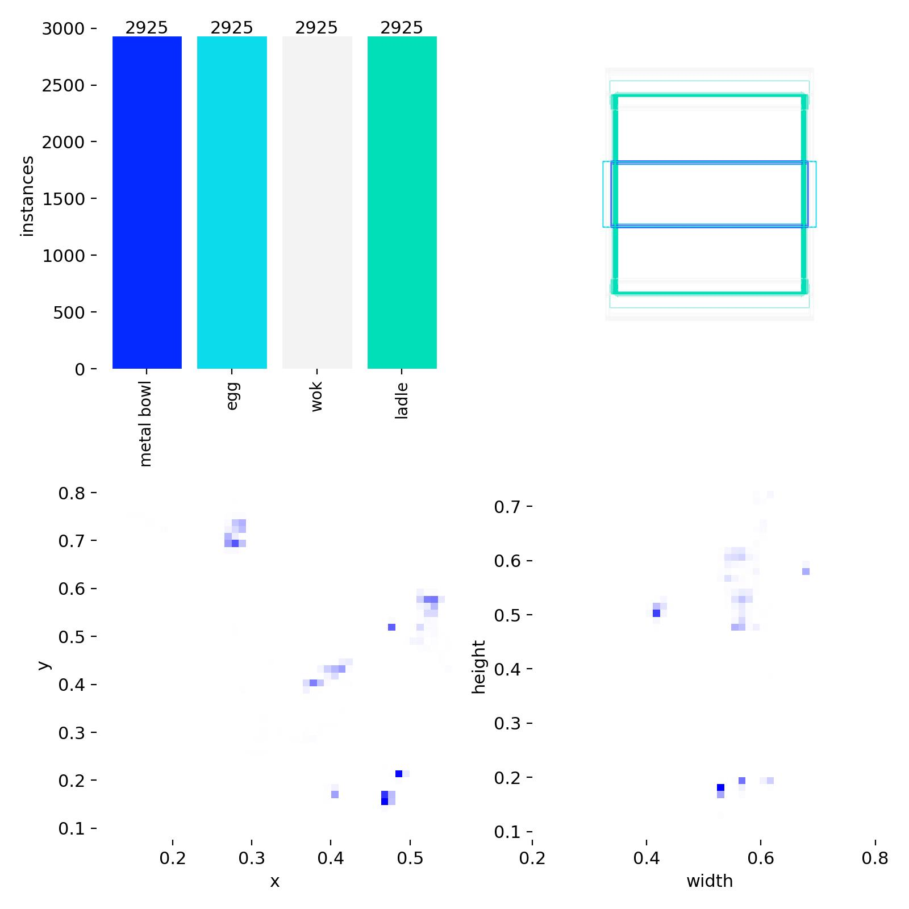
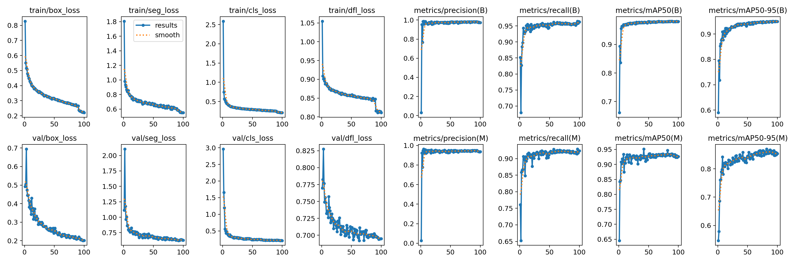

# Part 1 — YOLOv11-Seg ROS Pipeline

This section describes how to process ROS bag data, generate training data with Grounded-SAM2, and train a YOLOv11 segmentation model.

---

## 1. Clone the Repository

```bash
git clone --recursive git@github.com:Leo5050xvjf/cv-rl-assessment.git
cd cv-rl-assessment/part1_cv/yolov11-seg_ros
```

---

## 2. Prepare ROS Data


Place your `.db3` file under the following path:

```
ros_data/
└── interview_perception_exam01/
    ├── interview_perception_exam01_0.db3
    ├── metadata.yaml
```

---

## 3. Convert ROS Bag to MP4

Run the conversion script to extract RGB frames and convert them into an MP4 video:

```bash
bash python scripts/bag_to_frames.py && mv datasets/frames/video/rgb.mp4 ../vendors/Grounded-SAM-2/asset/kitchen.mp4
```

---

## 4. Generate Training Dataset (8/1/1 Split)

Switch to the Grounded-SAM2 directory and generate pseudo-labels for training:

```bash
cd ../vendors/Grounded-SAM-2
bash scripts/generate_training_data.sh
```

---

## 5. Train YOLOv11-Seg

Finally, go back to the YOLOv11-Seg directory and start training:

```bash
cd ../yolov11-seg_ros/ultralytics
bash train.sh
```

---


## Results

| Label Visualization | Detection Results |
|----------------------|-------------------|
|  | |


## Notes

- Ensure that the Grounded-SAM2 environment (`gsam2`) is properly set up.
- Generated pseudo-labels should contain all 4 target classes before training.
- The `train.sh` script assumes dataset paths are configured in `dataset.yaml`.


## 簡答題 1

### 在你看來，機器人在執行料理任務的過程中，有哪些關鍵性的 Perception 資訊是機器人必須精確掌握的？你會如何設計系統或方法來實作並有效獲取這些 Perception 資訊？

---

### 1. 物體的定位與識別（Object Detection / Segmentation）

**關鍵性：**  
機器人需精確辨識炒鍋、鍋鏟、雞蛋、鐵碗等關鍵器具的位置與邊界，確保操作臂能在安全距離內執行動作。

**方法：**  
透過 **Grounded-SAM2** 自動產生 mask，再以 **YOLOv11-seg** 進行訓練，建立可在實際場景中執行的即時分割模型。這能讓系統即時掌握器具位置，支援後續的動作規劃與碰撞避免。

---

### 2. 熱資訊（Thermal Perception）

**關鍵性：**  
烹飪過程中溫度變化是安全與食材品質控制的核心，例如辨識鍋內油溫、食材是否熟成。

**方法：**  
RGBT 影像的 Thermal 通道經偽彩轉換與對比度增強後，可作為輔助資訊整合至多模態模型，提升熱區域辨識能力。  
**補充：** 熱資訊可用來判斷食物熟成程度或油溫，雖然目前尚未納入訓練流程，但在實務應用中極為重要。

---

### 3. 食材狀態（Ingredient State）

**關鍵性：**  
食材在烹飪過程中會動態改變，如外觀、顏色、溫度等，需根據不同狀態採取相對應的行動策略。

**方法：**  
結合物體識別與熱資訊，偵測食材外觀與溫度變化，用於推斷熟度、濕度或可操作性。

---

### 整體設計方法

**前端感知層（Perception Layer）**  
- RGBT 同步擷取影像  
- Channel 分離  
- Thermal enhancement（偽彩與對比增強）  
- 物體 segmentation（YOLOv11-seg）

**中層融合（Fusion Layer）**  
- 將 RGB segmentation 與 Thermal map 融合，形成多模態特徵表示。

**後端決策層（Action Layer）**  
- 根據物體位置與狀態資訊產生 grasping pose。  
- 根據溫度閾值與物體識別結果觸發對應策略（如翻面、取出、降溫等）。


## 簡答題 2

> 假設上述的感知模型已經訓練完成，且達到理想的準確度與可靠性，你接下來會如何將這個模型實際應用在機器人的料理任務流程當中？

### 答案

當感知模型已穩定並具備可靠性時，我會將其整合進整個料理任務的閉迴路控制架構中，流程如下：

1. **感知輸入（Perception Input）**
   - ROS2 節點持續訂閱 RGBT 影像 topic。
   - YOLOv11‑seg 模型在節點中即時推論，輸出物體 mask、邊界框與類別資訊。

2. **任務推理（Task Reasoning）**
   - 根據分割結果判斷食材是否已放入鍋中、鍋鏟是否位於可抓取區域。  
   - 若 Thermal map 顯示溫度過高，則延遲放食材。

3. **動作規劃與執行（Action Planning & Execution）**
   - 透過相機內外參將 2D segmentation 結果轉換為 3D 座標。  
   - 控制器（如 Diffusion Policy）根據感知輸入產生連續動作，如拿取、翻面、放置。

4. **閉迴路更新（Feedback Loop）**
   - 在執行過程中持續監控感知輸出，若發現物體移動或偏差即時重新規劃。  
   - Thermal map 可作為「完成條件」判斷之一（例如：蛋白變白或變黑 → 停止加熱）。